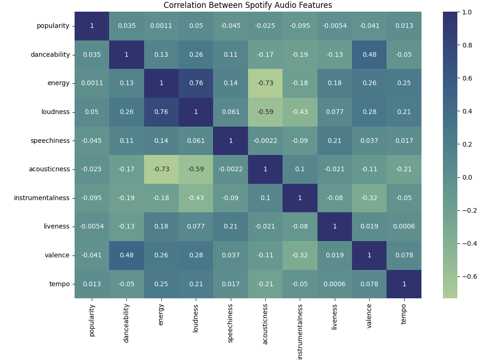
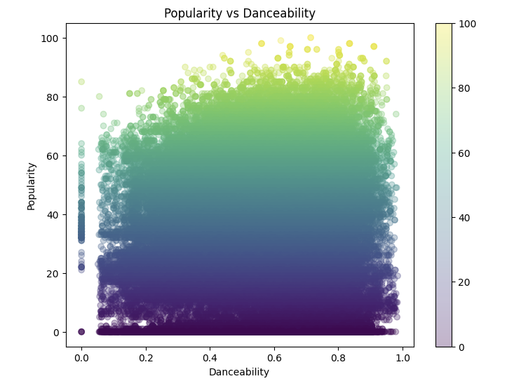
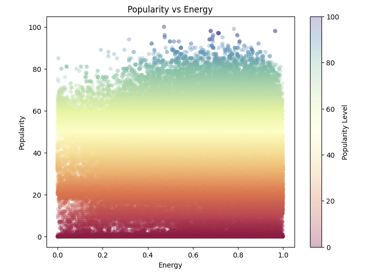
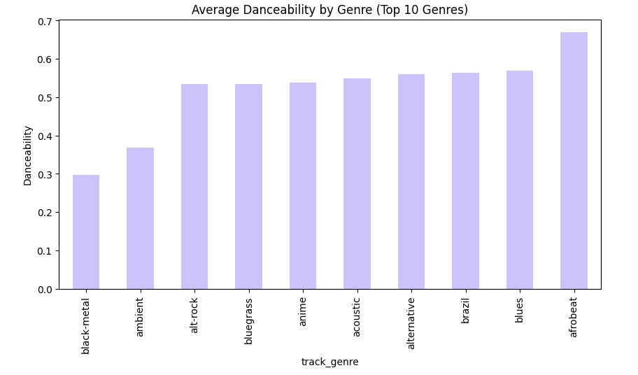
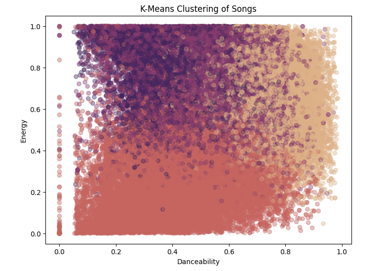
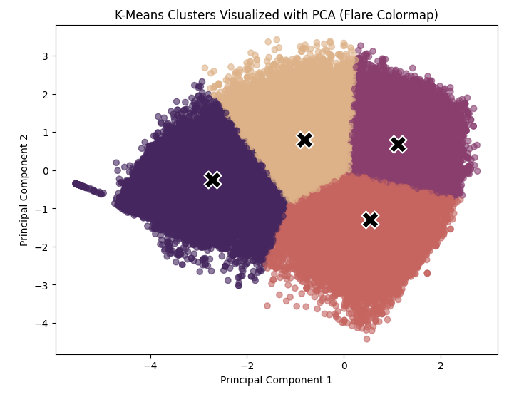

# Spotify Audio Features & Song Popularity Analysis

## Project Overview
This project uses Spotify audio feature data to understand patterns behind song popularity.

---
## Dataset

The dataset contains approximately 114,000 songs with the following features:

- track name, artist, genre  
- popularity score (0–100)  
- audio features:
  - danceability  
  - energy  
  - tempo  
  - valence  
  - acousticness  
  - instrumentalness  
  - speechiness  
  - liveness  

Source: Spotify audio feature dataset (Kaggle)

---

## Research Questions
1. Which audio features are most associated with song popularity?  
2. Do more danceable or energetic songs tend to be more popular?  
3. How do different genres differ in their musical characteristics?  

---

## Methods
The following data analysis techniques were used:

- Data cleaning and preprocessing (removal of unused columns, handling missing values)
- Correlation analysis between numerical features
- Data visualization (scatterplots, bar charts, heatmaps)
- K-Means clustering to group similar songs based on audio features

---

## New Techniques: K-Means Clustering + Principal Component Analysis (PCA)
K-Means clustering, an unsupervised machine learning method, was used to group songs based on similarities in their audio features, including danceability, energy, valence, tempo, and acousticness. This technique helped reveal natural groupings of songs with similar musical characteristics, allowing for a better understanding of how different styles of music relate to one another within the dataset. 

Principal Component Analysis (PCA) was then applied to reduce the high-dimensional audio feature space into two principal components. Since the dataset contains several correlated variables, PCA helps summarize the most important variation in the data while making it easier to visualize patterns in two dimensions.

By combining PCA with K-Means clustering, the resulting visualization shows not only how songs group together, but also how those groups relate in a simplified representation of overall musical style.

---

## Key Findings
- No single audio feature strongly determines popularity  
- Danceability and energy show weak relationships with popularity  
- Songs naturally cluster into groups with similar musical characteristics  
- Music preference appears to be multi-dimensional rather than driven by one factor  

---

## Key Visualizations

This project uses multiple visualizations to explore relationships between Spotify audio features and song popularity.

Visualization 1: Correlation Heatmap (Audio Features)
A correlation heatmap was used to examine relationships between all numerical Spotify audio features, such as danceability, energy, tempo, valence, and acousticness. This helped identify which features are most closely related and how strongly they interact with each other.

Visualization 2: Popularity vs Danceability Scatterplot
A scatterplot was used to examine whether more danceable songs tend to be more popular. This visualization shows a weak positive relationship, but with significant variation, suggesting that danceability alone does not strongly determine popularity.

Visualization 3: Energy vs Popularity Scatterplot (Optional)
A second scatterplot explores the relationship between energy and song popularity. The results show a similarly weak relationship, reinforcing the idea that popularity is influenced by multiple factors rather than a single feature.

Visualization 4: Genre Comparison Bar Chart (Average Danceability)
A bar chart compares average danceability across different genres. This reveals clear stylistic differences between genres, with some genres consistently producing more danceable music than others.

Visualization 5: K-Means Clustering 
K-Means clustering was applied to group songs based on similarities in their audio features. This visualization shows clusters using the original feature space, highlighting relationships between variables such as danceability, energy, and tempo.

Visualization 6: PCA + K-Means Clustering (Reduced Feature Space)

To better visualize the clustering structure, Principal Component Analysis (PCA) was used to reduce the high-dimensional audio feature space into two components. K-Means clustering was then applied to this reduced space. K-Means clustering was then applied to this reduced space, allowing for clearer visualization of natural groupings in the dataset. This representation highlights how songs cluster based on overall similarity in musical characteristics.

---

## Tools Used

This project was completed using Python and a set of data science and visualization libraries in Google Colab:

- Python (Pandas, NumPy)
- Data visualization (Matplotlib, Seaborn)
- Machine learning (Scikit-learn for K-Means clustering and PCA)
- Google Colab for analysis and experimentation
- GitHub Pages (Jekyll) for website deployment

Additional resources and support:
- CS 215 course materials and assignments
- DataCamp modules for structured learning
- AI tools (Google Gemini and ChatGPT) for debugging and conceptual support

---

## Project Files
All analysis was completed in a Google Colab notebook, with supporting files stored in the GitHub repository:
- Notebook containing full analysis and code
- Dataset used for analysis
- Images used for visualizations on this page

---

## Reflection
This project showed that music data is highly multi-dimensional, and simple assumptions (like “more energetic songs are more popular”) do not fully explain trends in popularity. The most interesting insight was how clearly songs form clusters based on audio similarity.

---

## Future Work
- Incorporate lyrics analysis (NLP)
- Explore trends over time more deeply
- Test additional clustering methods
